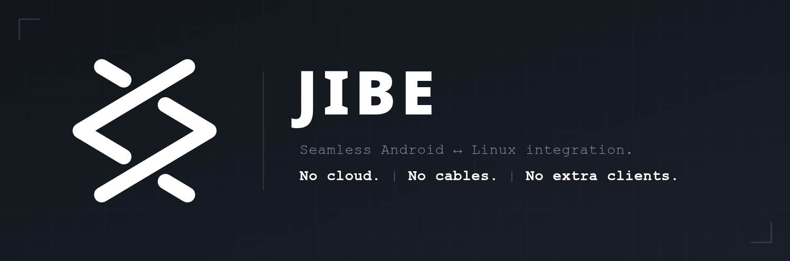

<div align="center">
  

  [](LICENSE)
  [](https://github.com/gobbledyglomp/jibe/releases)
</div>

---

Clipboard sync · file transfer · notification mirroring · find my phone · presentation remote · battery status — over LAN. No accounts, no cloud, no cables.

---

## Android

Download [`app-release.apk`](https://github.com/gobbledyglomp/jibe/releases) and sideload it. Keep the phone on the same Wi-Fi as the daemon. It discovers the daemon automatically.

---

## Linux daemon

| | `install.sh` | `pipx` | Docker |
|---|---|---|---|
| Icon in app launcher | ✓ | optional | ✗ |
| System tray | ✓ | optional | ✗ |
| Autostart on login | ✓ (default) | optional | ✓ (`restart: unless-stopped`) |
| Clipboard sync | ✓ | ✓ | ✗ |
| Presentation remote | ✓ | ✓ | ✗ |
| Terminal required day-to-day | ✗ | ✗ | ✗ |

Dashboard is always at **http://127.0.0.1:8777/** (same for all paths).

---

### `install.sh` (recommended for desktop users)

```bash
# 1. Prerequisites (example — Arch)
sudo pacman -S python-pipx git xdotool   # pipx is required; rest is optional

# 2. Clone and install
git clone https://github.com/gobbledyglomp/jibe.git && cd jibe
bash deploy/install.sh          # adds icon, launcher entry, starts on login
```

> Omit autostart: `bash deploy/install.sh --no-autostart`

**First-run password** — generated once, printed to the log:
```bash
journalctl --user -u jibe -b --no-pager | grep -A4 'Password (save now)'
```

Then: bookmark **http://127.0.0.1:8777/** → log in as `admin` → go to [Pair](#pairing).

---

### `pipx` (minimal, bring your own launcher)

```bash
# 1. Prerequisites
sudo pacman -S python-pipx       # Arch; or: sudo apt install pipx

# 2. Install
pipx install git+https://github.com/gobbledyglomp/jibe.git#subdirectory=daemon
pipx ensurepath && exec $SHELL   # make 'jibe' available

# 3. First run — copy the password from the output
jibe
```

**First-run password** is printed on stdout. Save it, then Ctrl+C.

Optional autostart (systemd user service):
```bash
cp deploy/jibe.service ~/.config/systemd/user/
systemctl --user daemon-reload && systemctl --user enable --now jibe
```

Then: bookmark **http://127.0.0.1:8777/** → log in as `admin` → go to [Pair](#pairing).

---

### Docker (headless — no clipboard, tray, or remote)

```bash
# 1. Prerequisites: Docker + Compose v2

# 2. Start
git clone https://github.com/gobbledyglomp/jibe.git && cd jibe
docker compose up -d

# 3. Retrieve the first-run password
docker compose logs daemon | grep -A4 'Password (save now)'
```

Then: bookmark **http://127.0.0.1:8777/** → log in as `admin` → go to [Pair](#pairing).

---

### Pairing

1. Open the dashboard → **Daemon → Start Pairing** (or tray → Start Pairing).
2. A 6-digit PIN appears.
3. Open the Android app → enter the PIN.
4. Done. The device reconnects automatically from now on.

After pairing, change the default admin password under **Settings → Users**.

---

## Contributing

See [CONTRIBUTING.md](CONTRIBUTING.md).

## License

[GNU General Public License v3.0](LICENSE)
