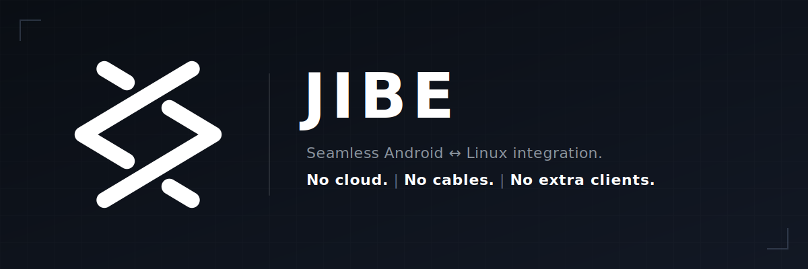

<div align="center">
  <p align="center">
    <br><br>
    <a href="LICENSE"></a>
    <a href="https://github.com/gobbledyglomp/jibe/releases"></a>
  </p>
</div>

---

Clipboard sync, file transfer, notification mirroring, find-my-phone, presentation remote, and battery status over LAN — no cloud, no accounts, no cables.

## Android

Install [`app-release.apk`](https://github.com/gobbledyglomp/jibe/releases) and keep the phone on the same Wi-Fi as the Linux daemon. Discovery is automatic.

## Linux daemon

| | `install.sh` | `pipx` | Docker |
|---|---|---|---|
| Launcher & tray | ✓ | optional | ✗ |
| Autostart | ✓ (default) | optional | ✓ |
| Clipboard & remote | ✓ | ✓ | ✗ |

Dashboard: **http://127.0.0.1:8777/**

### Desktop (`install.sh`)

```bash
sudo pacman -S python-pipx git    # Arch example; pipx is required
git clone https://github.com/gobbledyglomp/jibe.git && cd jibe
bash deploy/install.sh
```

`install.sh` prints the first-run admin password when it creates one. With default autostart, Jibe runs in the background — use the app menu or tray, not a second `jibe` in the terminal. Open a **new terminal** (or `export PATH="$HOME/.local/bin:$PATH"`) so the `jibe` command is found.

### `pipx`

```bash
pipx install git+https://github.com/gobbledyglomp/jibe.git#subdirectory=daemon
jibe    # password printed on first run; Ctrl+C when done
```

Optional launcher, tray, and autostart: copy `deploy/jibe.desktop` and `deploy/jibe.service` from the repo (see [daemon/README.md](daemon/README.md)).

### Docker

Headless daemon only (no clipboard, tray, or presentation remote). Requires host networking for mDNS.

```bash
git clone https://github.com/gobbledyglomp/jibe.git && cd jibe
docker compose up -d
docker compose logs daemon | grep -A4 'Password (save now)'
```

## Pairing

1. Dashboard → **Daemon → Start Pairing** (or tray → Start Pairing).
2. Enter the 6-digit PIN in the Android app.
3. Change the default `admin` password under **Settings → Users**.

## Documentation

| Topic | |
|---|---|
| Daemon setup & development | [daemon/README.md](daemon/README.md) |
| Protocol & architecture | [docs/](docs/) |
| Install issues, reset, uninstall | [docs/troubleshooting.md](docs/troubleshooting.md) |

## Contributing

See [CONTRIBUTING.md](CONTRIBUTING.md).

## License

[GNU General Public License v3.0](LICENSE)
