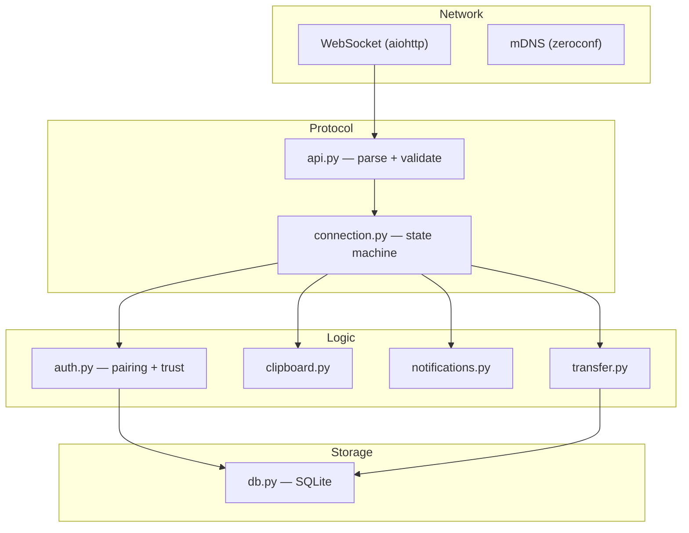
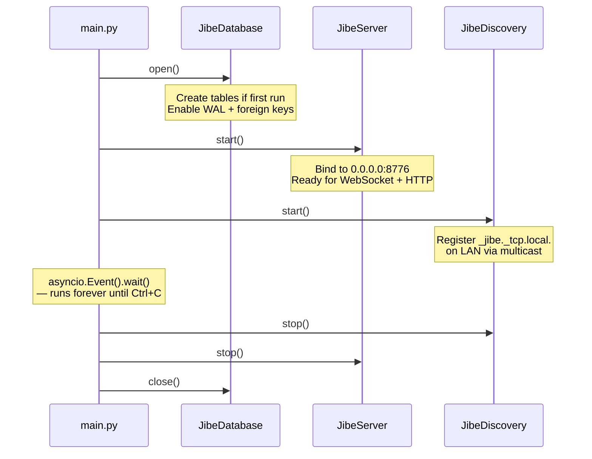

# Jibe Daemon Architecture

> How the pieces fit together.

## Module Map

```
daemon/
├── main.py                 ← entrypoint: wires everything, runs the event loop
└── jibe/
    ├── config.py            ← constants (port, PIN length, DB path, …)
    ├── server.py            ← aiohttp: HTTP + WebSocket, owns the message loop
    ├── discovery.py         ← mDNS broadcast via zeroconf
    ├── connection.py        ← per-connection state machine + registry
    ├── api.py               ← message parsing, validation, error formatting
    ├── auth.py              ← PIN pairing, fingerprint trust, rate limiting
    ├── db.py                ← async SQLite (devices, sessions)
    ├── clipboard.py         ← (stub) clipboard sync
    ├── notifications.py     ← (stub) notification mirroring
    └── transfer.py          ← (stub) file transfer
```

## Layers

The daemon is organised in three layers. Data flows **down** on
incoming messages and **up** on outgoing responses.



**Network** accepts bytes from the outside world.
**Protocol** turns bytes into typed, validated objects and enforces
auth-before-anything. **Logic** acts on those objects. **Storage**
persists state across restarts.

## Startup Sequence



All three services run concurrently in a **single asyncio event loop**.
There are no threads (except the one `aiosqlite` uses internally to
avoid blocking the loop on disk I/O).

## Ownership Graph

Who creates whom, and who holds a reference to whom:

```
main.py
  ├── creates JibeDatabase
  ├── creates JibeServer(db)
  │     ├── creates AuthManager(db)
  │     └── creates ConnectionRegistry
  └── creates JibeDiscovery
```

`JibeServer` is the central hub. It owns the `AuthManager` (which
needs the database to look up trusted devices) and the
`ConnectionRegistry` (which tracks every active WebSocket). Discovery
is independent — it only needs the port number.

## Design Principles

1. **Validate at the boundary.** Every raw JSON string passes through
   `parse_message()` before anything else touches it. If it returns,
   the message is well-formed. If it throws, the client gets a
   structured error. The rest of the codebase never handles raw input.

2. **Auth is a gate, not a check.** The connection state machine
   enforces authentication as a hard prerequisite — not a flag that
   handlers must remember to inspect. Once code runs inside the
   `AUTHENTICATED` branch, auth is guaranteed.

3. **One event loop, no threads.** Everything is `async/await` on a
   single thread. This eliminates race conditions by design. The only
   exception is `aiosqlite`, which uses one background thread for
   SQLite — but its async interface hides that completely.

4. **Extend by adding, not modifying.** New features (clipboard,
   files, notifications) will each be a handler function registered
   on a message type. The server, protocol layer, and auth logic
   remain untouched.
