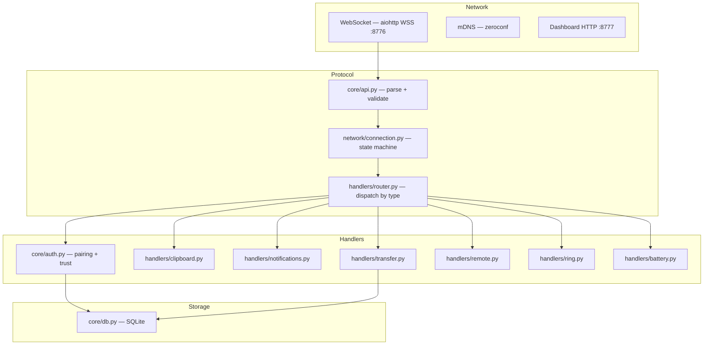
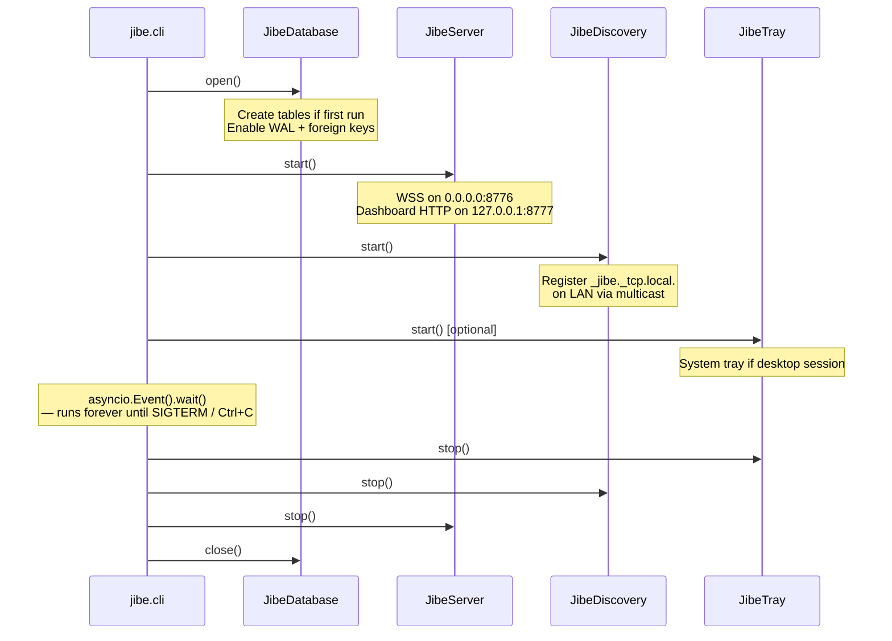

# Jibe Daemon Architecture

> How the pieces fit together.

## Module Map

```
daemon/
├── main.py                  ← thin script entry; delegates to jibe.cli
└── jibe/
    ├── cli.py               ← CLI wiring, run_daemon(), entry point for pip install
    ├── core/
    │   ├── api.py           ← message parsing & protocol validation
    │   ├── auth.py          ← PIN pairing, fingerprint trust, rate limiting
    │   ├── auth_jwt.py      ← JWT session auth for the dashboard
    │   ├── config.py        ← all constants (port, paths, timeouts, …)
    │   ├── db.py            ← async SQLite (devices, history, sessions)
    │   └── tls.py           ← self-signed certificate generation + SSL context
    ├── handlers/
    │   ├── battery.py       ← device battery telemetry
    │   ├── clipboard.py     ← clipboard sync (pyperclip / wl-paste)
    │   ├── device_features.py ← feature flag negotiation
    │   ├── notifications.py ← notification mirroring via notify-send
    │   ├── ping.py / pong.py ← heartbeat
    │   ├── remote.py        ← presentation remote (xdotool / ydotool)
    │   ├── ring.py          ← find-my-phone outbound ring
    │   ├── router.py        ← MessageRouter: dispatches by message type
    │   └── transfer.py      ← chunked file upload + checksum verification
    ├── network/
    │   ├── connection.py    ← per-connection state machine + ConnectionRegistry
    │   ├── dashboard_event_log.py ← in-memory event log for dashboard live feed
    │   ├── discovery.py     ← mDNS broadcast via zeroconf
    │   ├── ping_probe.py    ← RTT probe tracker
    │   └── server.py        ← aiohttp: WSS + plain-HTTP dashboard site
    ├── ui/
    │   └── tray.py          ← pystray system tray (optional, desktop only)
    └── web/static/          ← dashboard HTML/CSS/JS (served at /web/)
```

## Layers

Data flows **down** on incoming messages and **up** on outgoing responses.



## Startup Sequence



All services run concurrently in a **single asyncio event loop**.

## Ownership Graph

```
jibe.cli
  ├── creates JibeDatabase
  ├── creates JibeServer(db)
  │     ├── creates AuthManager(db)
  │     ├── creates JWTAuth(db)
  │     ├── creates ConnectionRegistry
  │     ├── creates MessageRouter
  │     ├── creates ClipboardMonitor
  │     └── creates DashboardEventLog
  └── creates JibeDiscovery
```

## Design Principles

1. **Validate at the boundary.** Every raw JSON string passes through
   `parse_message()` before anything else touches it. The rest of the
   codebase only ever sees typed, validated objects.

2. **Auth is a gate, not a check.** The connection state machine enforces
   authentication as a hard prerequisite. Code running inside the
   `AUTHENTICATED` branch has auth guaranteed — no handler needs to verify it.

3. **One event loop, no threads.** Everything is `async/await` on a single
   thread, eliminating race conditions by design. The only exception is
   `aiosqlite`, which uses one background thread for SQLite I/O.

4. **Extend by adding handlers.** New features are registered on the
   `MessageRouter` without touching the server, protocol layer, or auth logic.
