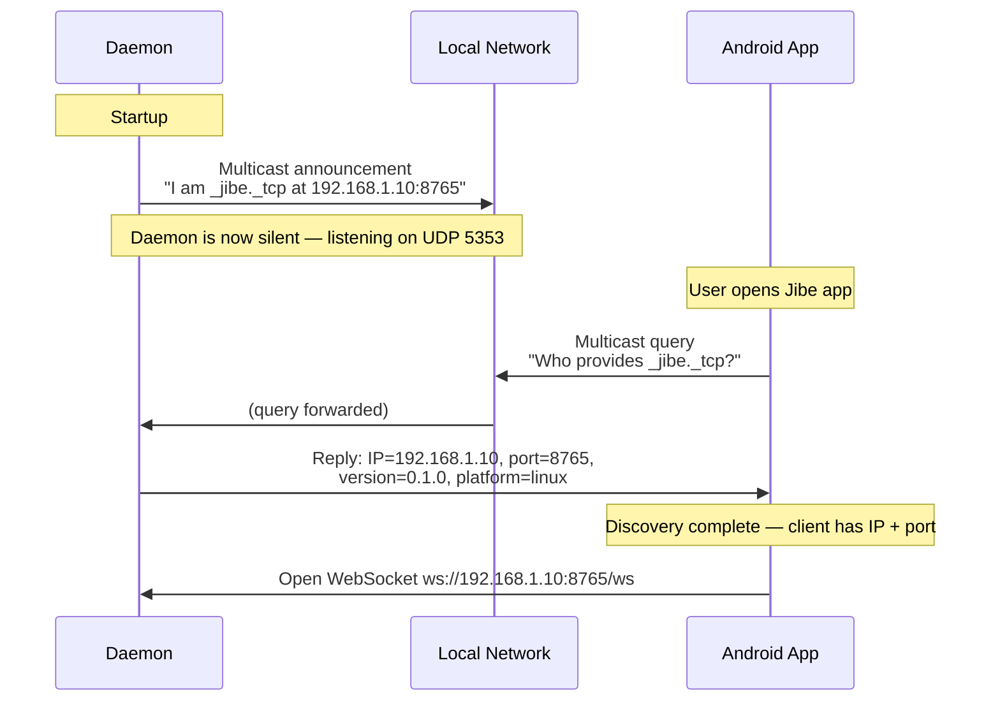
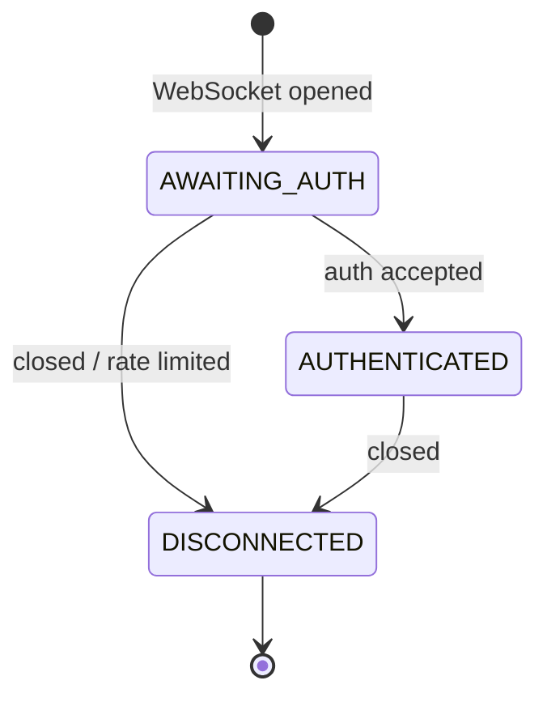

# Connection Flows

> From network discovery to active session.

## Discovery

The daemon does **not** continuously broadcast. It announces once at
startup, then responds on-demand when queried. This is standard mDNS
behaviour — the same mechanism behind Chromecast and AirPlay.

---

## Connection States

A connection can only move forward through these states.

| State | Allowed | On violation |
|-------|---------|-------------|
| `AWAITING_AUTH` | Only `auth.request` | `error: auth_required` |
| `AUTHENTICATED` | Any valid message type | Routed to handler |
| `DISCONNECTED` | Nothing | Removed from registry |
