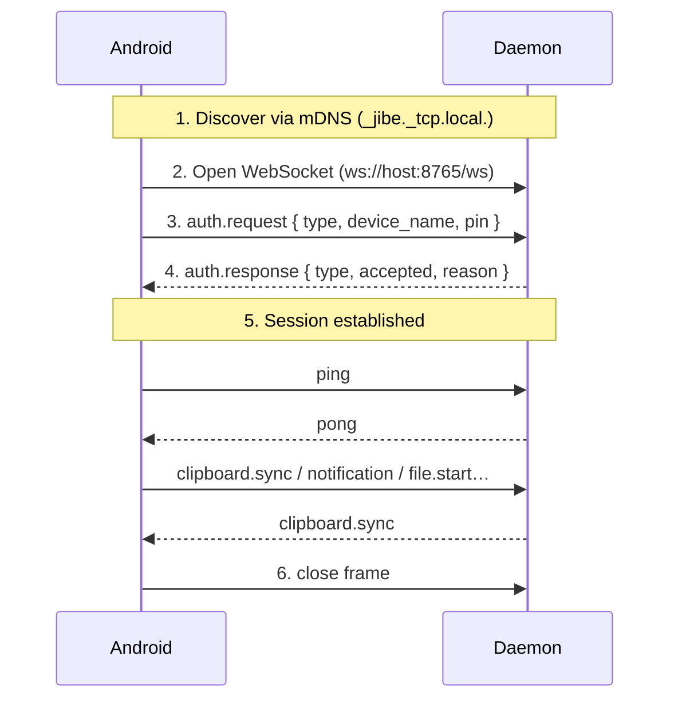

# Jibe WebSocket Protocol Specification

> Version: 0.2.0-beta · Status: Draft

## Design Philosophy

Jibe communicates over a single **WebSocket** connection between the Android app and the Linux daemon. Every message is a **JSON object** sent as a WebSocket text frame. The protocol is:

- **Human-readable** - JSON makes debugging easy (inspect with browser devtools, `websocat`, or `jq`)
- **Simple** - no binary framing, no compression negotiation, no sub-protocols
- **Easy to extend** - adding a new message type never breaks existing ones; unknown types are rejected with a clean error, not silently ignored
- **Stateless per-message** - each message is self-contained; the server does not track request/response pairs (the connection itself is stateful, but individual messages are not)

## Connection Lifecycle



### Step-by-step

1. **Discovery** - The daemon registers itself on the local network using mDNS (service type `_jibe._tcp.local.`). The Android app scans for this service and learns the daemon's IP and port.

2. **WebSocket handshake** - The app opens a WebSocket connection to `ws://<host>:<port>/ws`. This is a standard HTTP upgrade - no custom headers required.

3. **Authentication** - The app sends an `auth.request` message containing a PIN displayed on the daemon. On first connection, the user must manually approve the device. On subsequent connections, the daemon recognises trusted devices.

4. **Auth response** - The daemon responds with `auth.response`. If `accepted` is `true`, the session is live. If `false`, the daemon closes the connection after sending the response.

5. **Active session** - Both sides exchange messages freely. Keepalive is maintained via `ping`/`pong`. Any side can send `clipboard.sync` or `notification` messages at any time.

6. **Disconnection** - Either side can close the WebSocket normally. The daemon logs the disconnection and cleans up resources.

### Rules

- The **first message** from a client **must** be `auth.request`. Any other message before authentication will receive an `error` response with code `auth_required`.
- After authentication, either side can send any message type at any time.
- Unknown message types receive an `error` response with code `unknown_type`.
- Malformed JSON receives an `error` response with code `malformed_json`.

---

## Message Format

Every message is a JSON object with at minimum a `type` field:

```json
{
  "type": "<message_type>",
  ...additional fields depending on type
}
```

The `type` field determines the structure of the rest of the message. Additional fields are type-specific and documented below.

---

## Message Types

### `auth.request`

| Field         | Value                                                             |
| ------------- | ----------------------------------------------------------------- |
| **Direction** | Android → Linux                                                   |
| **Purpose**   | Authenticate a device with the daemon using a PIN and device name |

```json
{
  "type": "auth.request",
  "pin": "482916",
  "device_name": "Pixel 8 Pro"
}
```

| Field         | Type     | Description                                      |
| ------------- | -------- | ------------------------------------------------ |
| `type`        | `string` | Always `"auth.request"`                          |
| `pin`         | `string` | 6-digit PIN displayed on the daemon's UI or tray |
| `device_name` | `string` | Human-readable name of the connecting device     |

---

### `auth.response`

| Field         | Value                                                             |
| ------------- | ----------------------------------------------------------------- |
| **Direction** | Linux → Android                                                   |
| **Purpose**   | Inform the device whether authentication was accepted or rejected |

```json
{
  "type": "auth.response",
  "accepted": true,
  "reason": ""
}
```

```json
{
  "type": "auth.response",
  "accepted": false,
  "reason": "Invalid PIN"
}
```

| Field      | Type      | Description                                             |
| ---------- | --------- | ------------------------------------------------------- |
| `type`     | `string`  | Always `"auth.response"`                                |
| `accepted` | `boolean` | `true` if the device is now authenticated               |
| `reason`   | `string`  | Empty on success; human-readable explanation on failure |

---

### `ping`

| Field         | Value                                                   |
| ------------- | ------------------------------------------------------- |
| **Direction** | Bidirectional                                           |
| **Purpose**   | Keepalive probe — ensures the connection is still alive |

```json
{
  "type": "ping"
}
```

| Field  | Type     | Description     |
| ------ | -------- | --------------- |
| `type` | `string` | Always `"ping"` |

No additional fields. The receiver should respond with a `pong`.

---

### `pong`

| Field         | Value                                                 |
| ------------- | ----------------------------------------------------- |
| **Direction** | Bidirectional                                         |
| **Purpose**   | Keepalive response — confirms the connection is alive |

```json
{
  "type": "pong"
}
```

| Field  | Type     | Description     |
| ------ | -------- | --------------- |
| `type` | `string` | Always `"pong"` |

No additional fields.

---

### `clipboard.sync`

| Field         | Value                                         |
| ------------- | --------------------------------------------- |
| **Direction** | Bidirectional                                 |
| **Purpose**   | Synchronise clipboard content between devices |

```json
{
  "type": "clipboard.sync",
  "content": "https://example.com/interesting-article"
}
```

| Field     | Type     | Description                        |
| --------- | -------- | ---------------------------------- |
| `type`    | `string` | Always `"clipboard.sync"`          |
| `content` | `string` | The current clipboard text content |

---

### `notification`

| Field         | Value                                               |
| ------------- | --------------------------------------------------- |
| **Direction** | Android → Linux                                     |
| **Purpose**   | Mirror an Android notification to the Linux desktop |

```json
{
  "type": "notification",
  "app": "com.whatsapp",
  "title": "Alice",
  "body": "Hey, are you coming tonight?",
  "timestamp": 1710892800
}
```

| Field       | Type      | Description                                                           |
| ----------- | --------- | --------------------------------------------------------------------- |
| `type`      | `string`  | Always `"notification"`                                               |
| `app`       | `string`  | Android package name of the source app                                |
| `title`     | `string`  | Notification title                                                    |
| `body`      | `string`  | Notification body text                                                |
| `timestamp` | `integer` | Unix timestamp (seconds) when the notification was created on Android |

---

### `file.start`

| Field         | Value                                                      |
| ------------- | ---------------------------------------------------------- |
| **Direction** | Android → Linux                                            |
| **Purpose**   | Announce the start of a file transfer and provide metadata |

```json
{
  "type": "file.start",
  "id": "f47ac10b-58cc-4372-a567-0e02b2c3d479",
  "filename": "photo_2024.jpg",
  "size": 2048576,
  "total_chunks": 32
}
```

| Field          | Type      | Description                                                              |
| -------------- | --------- | ------------------------------------------------------------------------ |
| `type`         | `string`  | Always `"file.start"`                                                    |
| `id`           | `string`  | UUID identifying this transfer — all subsequent chunks reference this ID |
| `filename`     | `string`  | Original filename including extension                                    |
| `size`         | `integer` | Total file size in bytes                                                 |
| `total_chunks` | `integer` | Number of `file.chunk` messages that will follow                         |

---

### `file.chunk`

| Field         | Value                                         |
| ------------- | --------------------------------------------- |
| **Direction** | Android → Linux                               |
| **Purpose**   | Deliver one chunk of a file being transferred |

```json
{
  "type": "file.chunk",
  "id": "f47ac10b-58cc-4372-a567-0e02b2c3d479",
  "index": 0,
  "data": "iVBORw0KGgoAAAANSUhEUgAA..."
}
```

| Field   | Type      | Description                                   |
| ------- | --------- | --------------------------------------------- |
| `type`  | `string`  | Always `"file.chunk"`                         |
| `id`    | `string`  | Transfer ID matching the `file.start` message |
| `index` | `integer` | Zero-based chunk index                        |
| `data`  | `string`  | Base64-encoded chunk data                     |

---

### `file.done`

| Field         | Value                                                                    |
| ------------- | ------------------------------------------------------------------------ |
| **Direction** | Android → Linux                                                          |
| **Purpose**   | Signal that a file transfer is complete with a checksum for verification |

```json
{
  "type": "file.done",
  "id": "f47ac10b-58cc-4372-a567-0e02b2c3d479",
  "checksum": "e3b0c44298fc1c149afbf4c8996fb92427ae41e4649b934ca495991b7852b855"
}
```

| Field      | Type     | Description                                                  |
| ---------- | -------- | ------------------------------------------------------------ |
| `type`     | `string` | Always `"file.done"`                                         |
| `id`       | `string` | Transfer ID matching the `file.start` message                |
| `checksum` | `string` | SHA-256 hash of the complete file for integrity verification |

---

### `error`

| Field         | Value                                           |
| ------------- | ----------------------------------------------- |
| **Direction** | Bidirectional                                   |
| **Purpose**   | Report a protocol-level error to the other side |

```json
{
  "type": "error",
  "code": "malformed_json",
  "message": "Failed to parse JSON: Expecting property name enclosed in double quotes at line 1 column 2"
}
```

| Field     | Type     | Description                                    |
| --------- | -------- | ---------------------------------------------- |
| `type`    | `string` | Always `"error"`                               |
| `code`    | `string` | Machine-readable error code (see table below)  |
| `message` | `string` | Human-readable error description for debugging |

---

## Error Codes

| Code             | Meaning                                         | When it occurs                                   |
| ---------------- | ----------------------------------------------- | ------------------------------------------------ |
| `malformed_json` | The message could not be parsed as valid JSON   | Received data is not valid JSON                  |
| `unknown_type`   | The `type` field contains an unrecognised value | A message has a `type` not listed in this spec   |
| `auth_required`  | The client has not yet authenticated            | A non-auth message is sent before `auth.request` |
| `auth_rejected`  | Authentication was explicitly rejected          | Invalid PIN or device not trusted                |

---

## Versioning

The protocol version follows [SemVer](https://semver.org/):

- **Patch** (0.1.x) — bug fixes, clarifications, no message changes
- **Minor** (0.x.0) — new message types added, existing types unchanged
- **Major** (x.0.0) — breaking changes to existing message types

The daemon advertises its version via mDNS TXT records and the `GET /` health endpoint. Clients should check compatibility before connecting.
